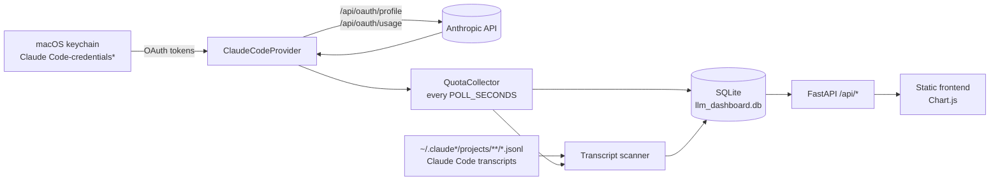

# LLM Quota Tracker

A small local dashboard that tracks how much of your **Claude Code** quota you
are using, across every Claude Code profile signed in on your Mac, and keeps
the history so you can see when a window resets and what consumed it.

It reads the same credentials Claude Code stores in the macOS keychain, asks
Anthropic's usage endpoint for the live utilisation, and indexes the transcripts
Claude Code writes locally to break usage down by model, session, project, tool
and skill. Nothing leaves your machine except those API calls.

Python (FastAPI + SQLite) backend, static HTML/JS frontend, no build step.

## What you get

- **Live quota** for every account: 5-hour window, 7-day window, model-scoped
  limits and extra-usage spend, pinned to the sidebar on every view.
- **Timeline** of utilisation with markers where a window reset or hit 100%,
  filterable by account, day and hour of day.
- **Usage insights** from your local transcripts: tokens and estimated cost per
  model, cache hit rate, activity heatmap, per-project and per-session totals,
  and which skills, plugins and tools drove the work.
- **Eleven views** behind a collapsible sidebar, each with its own URL, and
  four dark themes.
- Runs as a **24/7 background service** on macOS so the history has no gaps
  while the Mac is awake.

## Requirements

| Tool                                                     | Why                                                                   | Install                        |
| -------------------------------------------------------- | --------------------------------------------------------------------- | ------------------------------ |
| macOS                                                    | Credentials are read from the login keychain via `/usr/bin/security`. | –                              |
| [Claude Code](https://claude.com/claude-code), signed in | It is what we are measuring. Several profiles are fine.               | –                              |
| [uv](https://docs.astral.sh/uv/)                         | Creates the Python environment (Python 3.11+ is fetched if needed).   | `brew install uv`              |
| git                                                      | To clone and to deploy.                                               | ships with Xcode CLT           |
| [bun](https://bun.sh) _(development only)_               | Runs prettier for the frontend and docs.                              | `brew install oven-sh/bun/bun` |
| shellcheck _(development only)_                          | Lints the shell scripts.                                              | `brew install shellcheck`      |

## Install and run

```bash
git clone git@github.com:ArmandBriere/llm_dashboard.git
cd llm_dashboard
make run
```

`make run` creates `.venv`, installs the dependencies and starts the server on
<http://127.0.0.1:8000>, opening it in your browser. The first collection pass
runs immediately; the transcript index is built in the background and takes a
few seconds per thousand transcripts.

The first time it runs, macOS may ask whether `security` may read the
"Claude Code-credentials" keychain item. Choose **Always Allow**.

To run it without opening a browser, or on another port:

```bash
./start.sh --no-open
PORT=9000 ./start.sh
```

### Run it 24/7

Polling only happens while the server runs, so install it as a user
LaunchAgent to start at login and restart on crash:

```bash
make install     # render the plist, load the agent, start now
make status      # state / pid / last exit code
make logs        # tail stdout + stderr
make uninstall   # stop and remove
```

Once installed, `make deploy` pulls `origin/main` into the runtime checkout,
syncs dependencies, restarts the service and verifies it came back. The
runbook in [docs/running-24-7.md](docs/running-24-7.md) covers configuration,
logs, sleep and troubleshooting; [docs/deploying.md](docs/deploying.md) covers
updates and rollback.

## Configuration

Everything is an environment variable. For the foreground run, export it or
prefix the command; for the service, set it in the `EnvironmentVariables` dict
of `com.armandbriere.llm-dashboard.plist.template` and run `make install`.

| Variable                     | Default                        | Purpose                                                                                                                       |
| ---------------------------- | ------------------------------ | ----------------------------------------------------------------------------------------------------------------------------- |
| `LLM_DASHBOARD_POLL_SECONDS` | `300`                          | Seconds between two quota polls. Minimum `30`; lower values are raised to the floor, invalid values fall back to the default. |
| `LLM_DASHBOARD_DB_PATH`      | `<repo>/llm_dashboard.db`      | Where the SQLite database lives.                                                                                              |
| `HOST`                       | `127.0.0.1`                    | Listen address. Keep it on loopback: there is no authentication.                                                              |
| `PORT`                       | `8000`                         | Listen port.                                                                                                                  |
| `LLM_DASHBOARD_LOG_DIR`      | `~/Library/Logs/llm-dashboard` | Service only. Where `run-service.sh` writes and rotates logs.                                                                 |
| `LLM_DASHBOARD_CAFFEINATE`   | `0`                            | Service only. `1` wraps the server in `caffeinate -is` so the Mac does not idle-sleep.                                        |

Example, polling every two minutes in the foreground:

```bash
LLM_DASHBOARD_POLL_SECONDS=120 ./start.sh
```

The browser refreshes what is on screen every 30 seconds regardless of the
poll interval; it only shows data the collector has already stored.

## How it works



**1. Discover accounts.** Claude Code keeps one _home_ per profile: `~/.claude`
by default, or `~/.claude_<name>` when `CLAUDE_CONFIG_DIR` is set. Each home has
a keychain entry named `Claude Code-credentials` (default home) or
`Claude Code-credentials-<sha256(path)[:8]>`, which is the rule Claude Code
itself uses. The provider lists those entries, reads the OAuth token from each,
and refreshes it through Anthropic's token endpoint when it is about to expire,
writing the new token back so Claude Code stays signed in too.

**2. Poll the quota.** Every `LLM_DASHBOARD_POLL_SECONDS` (default 5 minutes)
the collector calls `/api/oauth/usage` for each account and stores a snapshot:
5-hour and 7-day utilisation, their reset times, any model-scoped weekly limit,
and extra-usage spend. The endpoint rate-limits readily; on a 429 the provider
falls back to the reading Claude Code cached in `.claude.json`, marks the
snapshot as _stale_, and the collector retries after 60 seconds instead of a
full interval. A cached reading whose window has already reset is discarded
rather than shown as current.

**3. Detect events.** Comparing each new snapshot with the previous one yields
three kinds of event: a 5-hour reset (a large drop, or a small drop with a new
reset deadline), a 7-day reset, and exhaustion (100%). They become the markers
on the timeline and the rows of the reset log.

**4. Index transcripts.** Each collection pass also scans
`~/.claude*/projects/**/*.jsonl`. Every assistant turn in those files records
the model and the exact token counts the API returned, which the usage endpoint
never exposes. The scanner remembers a byte offset per file and only reads new
lines, so a pass after the first one is cheap. Turns, tool calls and skill
invocations land in their own tables, attributed to an account through the
home directory they came from. See
[docs/usage-insights.md](docs/usage-insights.md) for what the derived numbers
mean and how cost is estimated.

**5. Serve.** FastAPI exposes everything under `/api/*`
([docs/api.md](docs/api.md)) and serves `frontend/` as static files with
no-cache headers. The frontend is plain JavaScript with Chart.js: one hash
route per view, one filter bar shared by all views, and only the visible view
fetches. It refreshes every 30 seconds and offers a **Poll now** button that
triggers a collection pass on demand.

## Development

```bash
make setup     # uv sync + bun install
make dev       # auto-reloading server on :8001, next to the service on :8000
make test      # pytest
make lint      # ruff, prettier --check, shellcheck
make format    # apply ruff and prettier
make check     # lint + test, what CI runs
```

Tests run against temporary databases and fake Claude homes, so they pass on a
machine with no keychain and no transcripts. CI runs `make check` on every push
and pull request.

Coding agents: read [AGENTS.md](AGENTS.md) first.

### Project layout

```
backend/
  main.py           FastAPI app and every /api route
  collector.py      polling loop, retry on cached readings
  config.py         LLM_DASHBOARD_* environment variables
  database.py       SQLite schema, snapshots, reset/exhaustion detection
  claude_home.py    Claude Code home dirs -> keychain service names
  providers/        BaseProvider and the Claude Code provider
  usage.py          transcript scanner and usage aggregates
  skills.py         skill / plugin / tool extraction and attribution
  pricing.py        model price table for the cost estimate
frontend/
  index.html        layout; style.css theme tokens; theme.js theme picker
  app.js            quota views and charts; usage.js insight views; nav.js router
tests/              pytest suite
docs/               API reference, usage-insights semantics, service runbooks
Makefile            make help
start.sh            foreground launcher; run-service.sh: launchd launcher
service.sh          install / uninstall / restart / status / logs
```

## Limitations

- **macOS only.** Credentials come from the login keychain, so the service must
  run inside your logged-in GUI session (a user LaunchAgent, not a daemon or a
  container).
- **A sleeping Mac stops polling.** The history will have gaps; see the sleep
  section of the runbook for mitigations.
- **Cost is an estimate.** Subscriptions are flat-rate. The dollar figures apply
  Anthropic's public API prices to your token counts to weight usage, not to
  tell you what you paid.
- **Claude Code only, for now.** `BaseProvider` is the seam for other tools.
