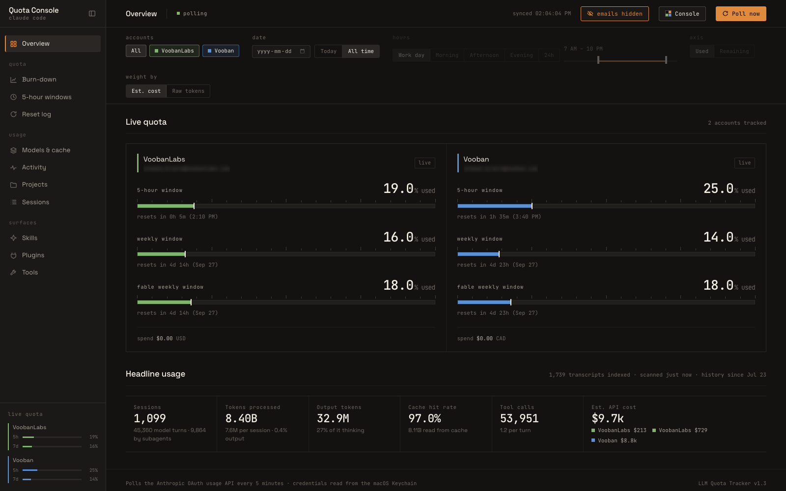
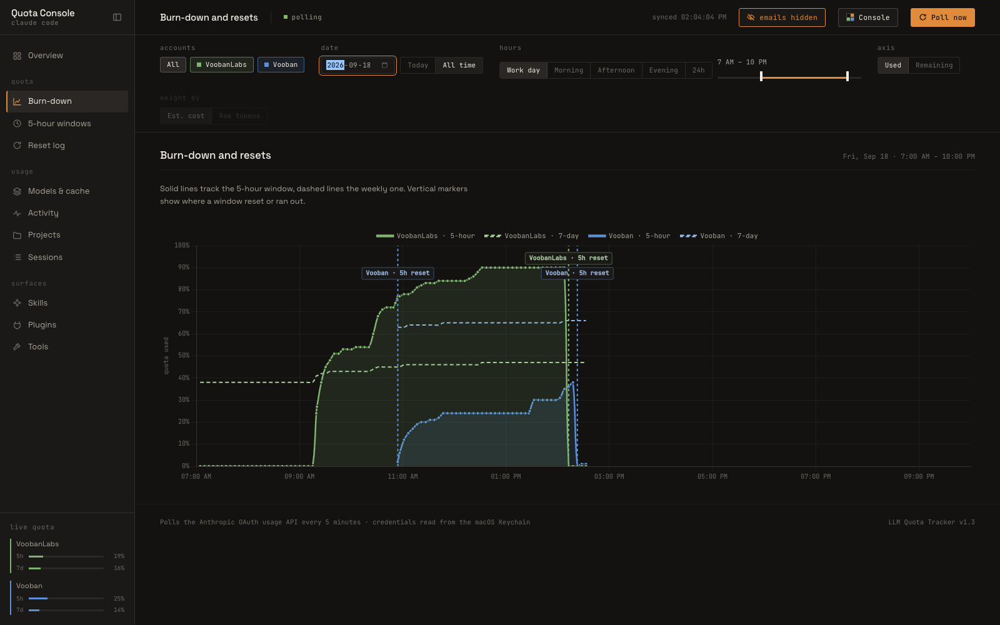
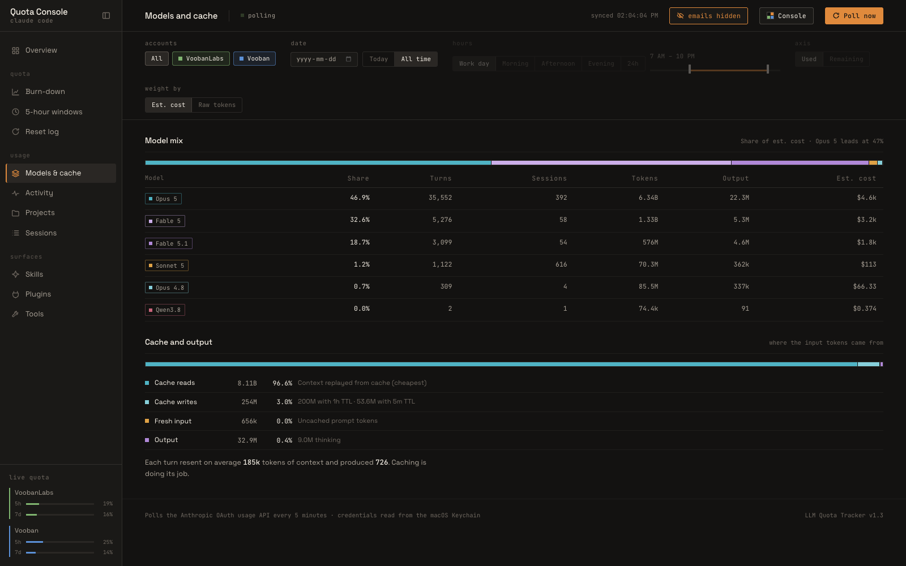
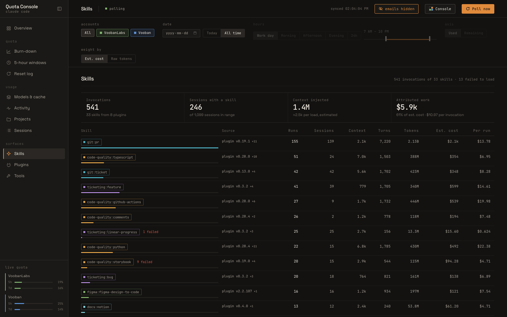
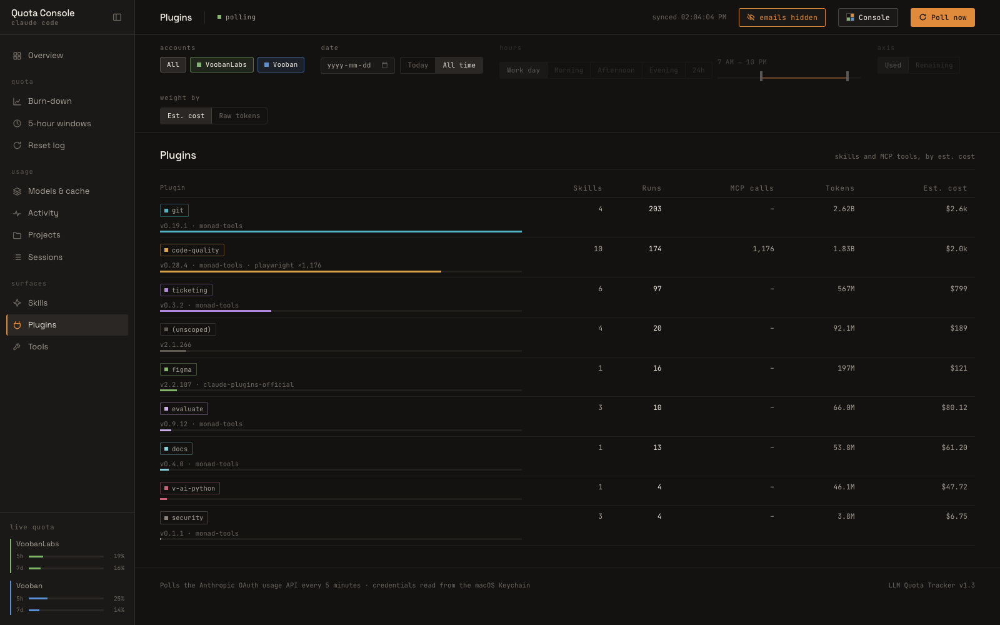
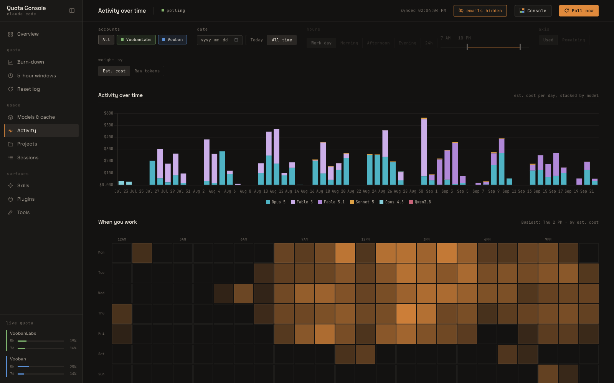
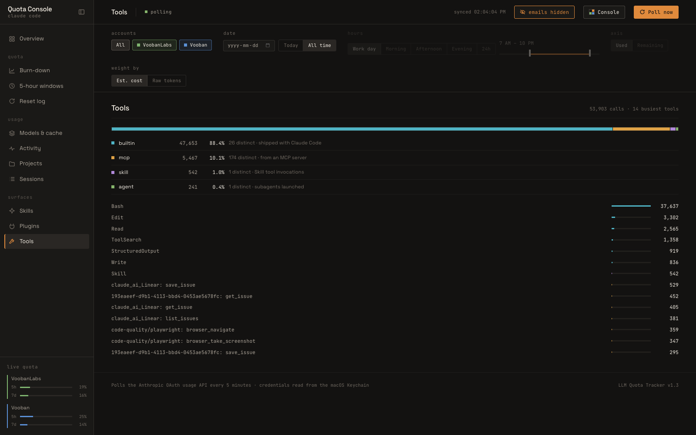
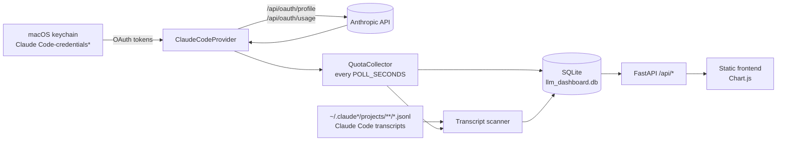

# LLM Quota Tracker

**Claude Code tells you how much quota you have left. This tells you where it
went.**

A local dashboard that watches every Claude Code profile signed in on your Mac,
keeps the history that the quota endpoint throws away on every reset, and reads
your own transcripts to break the burn down by model, project, session, tool,
plugin and skill.



Everything stays on your machine. Python (FastAPI + SQLite) backend, static
HTML/JS frontend, no build step, no telemetry, no account to create.

## Why not just `/usage`?

The built-in usage command answers one question — _how much is left, right
now, for the account I am signed into._ That is the question you ask when you
are already blocked. It is a live gauge with no memory: when your 5-hour window
resets, the reading that would have explained it is gone.

This tool is the flight recorder next to that gauge.

| Question                                         | `/usage` | This dashboard                                       |
| ------------------------------------------------ | -------- | ---------------------------------------------------- |
| How much is left right now?                      | yes      | yes, pinned to the sidebar on every view             |
| What did it look like an hour ago? Last Tuesday? | no       | full history, every reset and exhaustion marked      |
| Across all my Claude Code profiles at once?      | no       | every profile on the machine, side by side           |
| How many tokens exactly, per model?              | no       | exact counts from the transcripts, not percentages   |
| Which project or session burned the window?      | no       | per-project and per-session breakdown                |
| What are my skills and plugins costing me?       | no       | runs, injected context and attributed work per skill |

The quota API only ever reports percentages. Your transcripts record the exact
token counts the API returned for every single turn — input, cache write, cache
read, output, thinking. Indexing them locally is what turns "you are at 87%"
into "Opus 5 on the voice-orchestrator refactor, 6.2B tokens, mostly cache
reads."

### Never wonder where the window went

Solid lines are the 5-hour window, dashed the weekly one. Every reset and every
100% wall is marked, so a spike has a timestamp you can go look up.



### Real token counts, and proof the cache is working

Model mix by estimated cost, and where the input tokens actually came from.
Cache reads are a tenth the price of fresh input, so the hit rate is the single
biggest lever on how fast a window drains.



### Skills and plugins: the cost nobody else measures

This is the part you cannot get anywhere else, and it is the reason the tool
exists.

A skill has no token usage of its own, so nothing reports on it. But every
skill you load **injects its instruction text into the context of every
subsequent turn**, and you pay for that on every one of them. A dashboard that
only shows models cannot see this at all.



Three numbers, deliberately kept separate because they mean different things:

- **Context injected** — what the skill costs you directly, just by loading.
  Most plugin skills inject 1k–7k tokens; the bundled `claude-api` skill injects
  about 142k. That is the difference between a rounding error and half a window.
- **Runs** — how often it actually fires. A skill that injects 7k tokens and
  runs twice a month is not the problem. One that injects 7k and runs 153 times
  is.
- **Attributed work** — the turns and tokens spent _after_ the skill loaded,
  charged to the skill most recently loaded in that transcript, so the rows
  partition the work instead of double-counting it.

It also catches the thing nobody notices: **skills that fail to load.** In the
screenshot above, 13 invocations came back `Unknown skill` — a broken or renamed
skill, invoked over and over, costing a tool call and a retry every time.



Rolled up by plugin, that becomes an honest answer to a question every team
asks after a month of enthusiastic plugin installation: **which of these are we
actually using?** Skills shipped, runs, MCP calls and cost, per plugin, per
version. The ones sitting at zero are just context tax.

### Where the time and the tool calls go

Cost per day stacked by model, a heatmap of when you actually work, and a
leaderboard splitting tool calls into builtin, MCP server, skill and subagent.





_Screenshots are one developer's real machine over about two months: 1,706
transcripts, 1,067 sessions, 8.27B tokens._

## What you get

- **Live quota** for every account: 5-hour window, 7-day window, model-scoped
  limits and extra-usage spend, pinned to the sidebar on every view.
- **Timeline** of utilisation with markers where a window reset or hit 100%,
  filterable by account, day and hour of day.
- **Usage insights** from your local transcripts: tokens and estimated cost per
  model, cache hit rate, activity heatmap, per-project and per-session totals,
  and which skills, plugins and tools drove the work.
- **Eleven views** behind a collapsible sidebar, each with its own URL, and
  four dark themes.
- **Privacy mode** blurs every account email with one click, so the console can
  be screenshotted or screen-shared as-is.
- Runs as a **24/7 background service** on macOS so the history has no gaps
  while the Mac is awake.

## Try it in two minutes

```bash
git clone git@github.com:ArmandBriere/llm_dashboard.git
cd llm_dashboard
make run
```

That is the whole setup. It finds your profiles in the keychain, starts
collecting, and opens <http://127.0.0.1:8000>. The transcript index builds in
the background — you will have months of history charted before you finish
reading this README, because Claude Code has been writing those transcripts all
along.

## Requirements

| Tool                                                     | Why                                                                   | Install                        |
| -------------------------------------------------------- | --------------------------------------------------------------------- | ------------------------------ |
| macOS                                                    | Credentials are read from the login keychain via `/usr/bin/security`. | –                              |
| [Claude Code](https://claude.com/claude-code), signed in | It is what we are measuring. Several profiles are fine.               | –                              |
| [uv](https://docs.astral.sh/uv/)                         | Creates the Python environment (Python 3.11+ is fetched if needed).   | `brew install uv`              |
| git                                                      | To clone and to deploy.                                               | ships with Xcode CLT           |
| [bun](https://bun.sh) _(development only)_               | Runs prettier for the frontend and docs.                              | `brew install oven-sh/bun/bun` |
| shellcheck _(development only)_                          | Lints the shell scripts.                                              | `brew install shellcheck`      |

## Install and run

`make run` creates `.venv`, installs the dependencies and starts the server on
<http://127.0.0.1:8000>, opening it in your browser. The first collection pass
runs immediately; the transcript index is built in the background and takes a
few seconds per thousand transcripts.

The first time it runs, macOS may ask whether `security` may read the
"Claude Code-credentials" keychain item. Choose **Always Allow**.

To run it without opening a browser, or on another port:

```bash
./start.sh --no-open
PORT=9000 ./start.sh
```

### Run it 24/7

Polling only happens while the server runs, so install it as a user
LaunchAgent to start at login and restart on crash:

```bash
make install     # render the plist, load the agent, start now
make status      # state / pid / last exit code
make logs        # tail stdout + stderr
make uninstall   # stop and remove
```

Once installed, `make deploy` pulls `origin/main` into the runtime checkout,
syncs dependencies, restarts the service and verifies it came back. The
runbook in [docs/running-24-7.md](docs/running-24-7.md) covers configuration,
logs, sleep and troubleshooting; [docs/deploying.md](docs/deploying.md) covers
updates and rollback.

## Configuration

Everything is an environment variable. For the foreground run, export it or
prefix the command; for the service, set it in the `EnvironmentVariables` dict
of `com.armandbriere.llm-dashboard.plist.template` and run `make install`.

| Variable                     | Default                        | Purpose                                                                                                                       |
| ---------------------------- | ------------------------------ | ----------------------------------------------------------------------------------------------------------------------------- |
| `LLM_DASHBOARD_POLL_SECONDS` | `300`                          | Seconds between two quota polls. Minimum `30`; lower values are raised to the floor, invalid values fall back to the default. |
| `LLM_DASHBOARD_DB_PATH`      | `<repo>/llm_dashboard.db`      | Where the SQLite database lives.                                                                                              |
| `HOST`                       | `127.0.0.1`                    | Listen address. Keep it on loopback: there is no authentication.                                                              |
| `PORT`                       | `8000`                         | Listen port.                                                                                                                  |
| `LLM_DASHBOARD_LOG_DIR`      | `~/Library/Logs/llm-dashboard` | Service only. Where `run-service.sh` writes and rotates logs.                                                                 |
| `LLM_DASHBOARD_CAFFEINATE`   | `0`                            | Service only. `1` wraps the server in `caffeinate -is` so the Mac does not idle-sleep.                                        |

Example, polling every two minutes in the foreground:

```bash
LLM_DASHBOARD_POLL_SECONDS=120 ./start.sh
```

The browser refreshes what is on screen every 30 seconds regardless of the
poll interval; it only shows data the collector has already stored.

## How it works



**1. Discover accounts.** Claude Code keeps one _home_ per profile: `~/.claude`
by default, or `~/.claude_<name>` when `CLAUDE_CONFIG_DIR` is set. Each home has
a keychain entry named `Claude Code-credentials` (default home) or
`Claude Code-credentials-<sha256(path)[:8]>`, which is the rule Claude Code
itself uses. The provider lists those entries, reads the OAuth token from each,
and refreshes it through Anthropic's token endpoint when it is about to expire,
writing the new token back so Claude Code stays signed in too.

**2. Poll the quota.** Every `LLM_DASHBOARD_POLL_SECONDS` (default 5 minutes)
the collector calls `/api/oauth/usage` for each account and stores a snapshot:
5-hour and 7-day utilisation, their reset times, any model-scoped weekly limit,
and extra-usage spend. The endpoint rate-limits readily; on a 429 the provider
falls back to the reading Claude Code cached in `.claude.json`, marks the
snapshot as _stale_, and the collector retries after 60 seconds instead of a
full interval. A cached reading whose window has already reset is discarded
rather than shown as current.

**3. Detect events.** Comparing each new snapshot with the previous one yields
three kinds of event: a 5-hour reset (a large drop, or a small drop with a new
reset deadline), a 7-day reset, and exhaustion (100%). They become the markers
on the timeline and the rows of the reset log.

**4. Index transcripts.** Each collection pass also scans
`~/.claude*/projects/**/*.jsonl`. Every assistant turn in those files records
the model and the exact token counts the API returned, which the usage endpoint
never exposes. The scanner remembers a byte offset per file and only reads new
lines, so a pass after the first one is cheap. Turns, tool calls and skill
invocations land in their own tables, attributed to an account through the
home directory they came from. See
[docs/usage-insights.md](docs/usage-insights.md) for what the derived numbers
mean and how cost is estimated.

**5. Serve.** FastAPI exposes everything under `/api/*`
([docs/api.md](docs/api.md)) and serves `frontend/` as static files with
no-cache headers. The frontend is plain JavaScript with Chart.js: one hash
route per view, one filter bar shared by all views, and only the visible view
fetches. It refreshes every 30 seconds and offers a **Poll now** button that
triggers a collection pass on demand.

## Development

```bash
make setup     # uv sync + bun install
make dev       # auto-reloading server on :8001, next to the service on :8000
make test      # pytest
make lint      # ruff, prettier --check, shellcheck
make format    # apply ruff and prettier
make check     # lint + test, what CI runs
```

Tests run against temporary databases and fake Claude homes, so they pass on a
machine with no keychain and no transcripts. CI runs `make check` on every push
and pull request.

Coding agents: read [AGENTS.md](AGENTS.md) first.

### Project layout

```
backend/
  main.py           FastAPI app and every /api route
  collector.py      polling loop, retry on cached readings
  config.py         LLM_DASHBOARD_* environment variables
  database.py       SQLite schema, snapshots, reset/exhaustion detection
  claude_home.py    Claude Code home dirs -> keychain service names
  providers/        BaseProvider and the Claude Code provider
  usage.py          transcript scanner and usage aggregates
  skills.py         skill / plugin / tool extraction and attribution
  pricing.py        model price table for the cost estimate
frontend/
  index.html        layout; style.css theme tokens; theme.js theme picker
  app.js            quota views and charts; usage.js insight views; nav.js router
tests/              pytest suite
docs/               API reference, usage-insights semantics, service runbooks
Makefile            make help
start.sh            foreground launcher; run-service.sh: launchd launcher
service.sh          install / uninstall / restart / status / logs
```

## Limitations

- **macOS only.** Credentials come from the login keychain, so the service must
  run inside your logged-in GUI session (a user LaunchAgent, not a daemon or a
  container).
- **A sleeping Mac stops polling.** The history will have gaps; see the sleep
  section of the runbook for mitigations.
- **Cost is an estimate.** Subscriptions are flat-rate. The dollar figures apply
  Anthropic's public API prices to your token counts to weight usage, not to
  tell you what you paid.
- **Claude Code only, for now.** `BaseProvider` is the seam for other tools.
